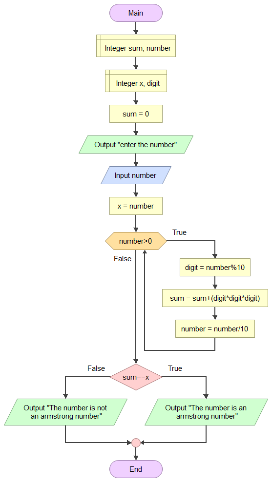

>#**Task-6**
# **Armstrong numbers.**
>**pseudocode for armstrong numbers**
* declare integers *sum,number,x,digit*
* assign the variable *sum* as 0.
* use *number* to get the input from the user.

* assign *x* to variable *number*
* create a while loop with a condition *number>0*
* If the while condition is true then:- 
     
1. Assign **digit=number%10**
     
2. **sum+(digit * digit * digit**)
3. **number=number/10**

* If the while condition is false:-
1. If sum==x is true then **The given number is an armstrong number**.
2. If sum==x is false then **The given number is not an armstrong number**.)

